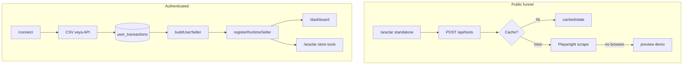

# TrueMargin — Sistem Röntgeni

Bu rapor, projeyi sıfırdan devralan bir kıdemli yazılımcıya “ilk gün brifingi” gibi yazılmıştır.  
Ürün adı **TrueMargin**; repo klasörü `matsorular`.  
Amaç: Türk pazaryeri satıcılarına **algılanan marj vs gerçek (true) marj** farkını göstermek, sessiz zarar eden SKU’ları bulmak, ücretsiz SEO araçlarıyla lead üretmek, bağlanan mağaza verisiyle panele taşımak.

> Oluşturulma: 2026-09-22  
> Kaynak: kod tabanı taraması (`app/`, `lib/`, `components/`, `supabase/migrations/`, `tests/`, `PROJECT_STATE.md`)

---

## 1. Mevcut Mimari ve Teknoloji Yığını

### 1.1 Çekirdek stack

| Katman | Seçim | Not |
|--------|--------|-----|
| Framework | **Next.js 16.2.6** (App Router) | `app/` |
| UI | **React 19** | Client/server bileşenleri karışık |
| Dil | **TypeScript 5.7** | `next.config.mjs` içinde `ignoreBuildErrors: true` — tip hataları build’i düşürmez |
| Stil | **Tailwind CSS v4** + PostCSS + `tw-animate-css` | `app/globals.css` |
| UI kit | shadcn + Base UI + lucide + CVA | `components/ui/`, `components.json` |
| Auth + DB | **Supabase** (`@supabase/ssr` + `supabase-js`) | Cookie session + RLS |
| Scraping | **Playwright** + Vercel’de **`@sparticuz/chromium`** | `lib/scrapers/browser.ts` |
| Faturalama | **iyzico** (TR asıl), **Stripe** (hâlâ wired) | `lib/iyzico/`, `lib/billing/` |
| AI | Vercel AI SDK + Anthropic; Gemini fallback | `app/api/chat/route.ts` |
| Validasyon | Zod 4 | `lib/domain/schemas.ts` |
| i18n | i18next — varsayılan **`tr`**, opsiyonel `en` | `lib/i18n/` |
| Test | **Vitest 4** | `tests/**/*.test.ts` |
| Deploy | **Vercel** (fra1) | `vercel.json` cron’lar |

**Scripts (`package.json`):** `dev` / `build` / `start` / `lint` / `test` / `test:coverage` / `demo`

### 1.2 Üst seviye klasör haritası

```text
app/                 Sayfalar + API route'ları
components/          Dashboard, tools, marketing, billing, connect
lib/                 Domain motoru, adapterlar, scraperlar, billing, supabase
supabase/migrations/ 0001–0037 SQL
tests/               Vitest
proxy.ts             Auth + premium gate (Next 16; eski middleware.ts)
chrome-extension/    MV3 “TrueMargin Asistan”
truemargin-core/     Eski çekirdek snapshot (arşiv; canlı truth = lib/)
profit-engine/       Python yan proje (ana TS app’ten ayrı)
scripts/             Probe / one-off scriptler
PROJECT_STATE.md     Operasyon günlüğü (Claude Code + Cursor paralel)
SISTEM_RONTGENI.md   Bu dosya — mimari brifing
```

### 1.3 Ana route’lar ve görevleri

**Sayfalar**

| Route | Dosya | Görev |
|-------|--------|--------|
| `/` | `app/page.tsx` | Marketing landing |
| `/login`, `/signup`, şifre sıfırlama | `app/login/…` | Auth |
| `/connect` | `app/connect/page.tsx` | Onboarding: pazaryeri + CSV |
| `/dashboard` | `app/dashboard/page.tsx` (~2.8k satır) | Ana panel — tek “ağır” UI yüzeyi |
| `/araclar/[slug]` | `app/araclar/[slug]/page.tsx` | Ücretsiz + mağaza araçları |
| `/pricing` | `app/pricing/page.tsx` | Planlar |
| `/financing/[tenantId]`, `/reveal/[tenantId]` | ilgili `page.tsx` | Seed/demo anlatı yüzeyleri |
| `/team/accept` | `app/team/accept/page.tsx` | Ekip daveti |
| Marketing/legal | `hakkimizda`, `sss`, `urunler`, `gizlilik`… | Public içerik |

**API (özet)**

- Araçlar: `POST /api/tools/[toolId]`, barcode import, visibility scan
- Bağlantı: Trendyol / Hepsiburada / N11 connect; Shopify OAuth+webhook; Amazon OAuth; resync/disconnect
- Billing: iyzico checkout/callback; Stripe setup/trial/status
- Ürün: `/api/chat`, ledger, benchmarks, team, extension token
- Cron: marketplace sync, benchmarks, precrawl, weekly digest, scan-visibility

### 1.4 `lib/` zihinsel modeli

```text
Ingest (CSV/API) → Adapter (fee model) → Canonical Transaction
  → buildUserSeller → registerRuntimeSeller (bellek)
  → getSeller / getFinancing / recomputeMargin → UI / Copilot
```

Kritik dosyalar:

- `lib/engine.ts` — runtime seller registry + dashboard API’si
- `lib/domain/margin-engine.ts` — perceived vs true margin
- `lib/adapters/*` — Trendyol, HB, N11, Shopify, Amazon, CSV
- `lib/scrapers/*` — browser + visibility + price-tracker
- `lib/tools/*` — registry, run-standalone, parse-query, store-gate
- `lib/supabase/user-data.ts` — `user_transactions` CRUD + `buildUserSeller`
- `lib/marketplaces.ts` — hangi kanalın `engineChannel` / `api_key` / `coming_soon` olduğu

### 1.5 Veritabanı (Supabase)

37 migration. Öne çıkan tablolar:

| Tablo | Ne için |
|--------|---------|
| `user_transactions` | Satış satırları (CSV + API sync) |
| `marketplace_credentials` | Şifreli API anahtarları + sync status |
| `product_costs` | SKU maliyet profili (sync’te 0 gelen COGS’u doldurur) |
| `decision_ledger` | Underwriting karar geçmişi |
| `iyzico_subscriptions` / `billing_subscriptions` | Abonelik |
| `shared_*_scans` | Misafir scraper cache (visibility / price / top100) |
| `guest_tool_usage` | Günlük sorgu kotası |
| `tenant_members` | Ekip (viewer) |
| `extension_tokens` | Chrome uzantısı |

**Önemli operasyon notu:** Bazı migration yorumlarında “yazıldı ama uygulanmadı” izi var. Prod’da hangi migration’ların gerçekten uygulandığını doğrulamadan “tablo var” varsayma.

---

## 2. Çalışma Mantığı ve Veri Akışı

### 2.1 Üç ürün yüzeyi



1. **Standalone (misafir):** Görünürlük, fiyat takibi, top100, index — store gerekmez; rate limit (misafir ~2, auth ~10, paid ~50).
2. **Store-required:** Net kâr, zarar alarmı, güvenli fiyat… — giriş + (credential **veya** satış satırı).
3. **Dashboard:** Motorun tam yüzeyi + Copilot + Verilerim + faturalama.

### 2.2 Veri nasıl girer?

| Kaynak | Akış |
|--------|------|
| CSV / manuel | `parseCsv` → `validateUserRawRows` → `saveUserRows` → Supabase |
| Trendyol/HB/N11 | Modal → `/api/*/connect` → canlı API doğrulama → encrypted credentials → `saveDedupedTransactions` |
| Shopify | OAuth + webhook + saatlik cron backstop |
| Amazon | OAuth yolları var; sipariş sync olgunluğu pazaryerine göre kısmi |

`order_id` ile de-dupe kritik: reconnect’te GMV’nin ikiye katlanmasını engeller (`lib/save-user-transactions.ts`).

### 2.3 Motor nasıl hesaplar?

1. `loadUserRowsWithStatus()` satırları okur; `product_costs` ile zenginleştirir.
2. `buildUserSeller` satırları marketplace’e göre böler → ilgili adapter fee waterfall üretir → `Transaction[]`.
3. Validation tüm satırları düşürürse **`null`** (boş seller register edilmez).
4. `registerRuntimeSeller` → process/bellek içi `RUNTIME_SELLERS` (SSR’da request, client’ta session).
5. UI `getSeller(tenant, channel)` çağırır; kanal: `trendyol | hepsiburada | n11 | amazon_* | shopify | combined`.
6. **Algılanan marj:** çoğunlukla komisyon + COGS. **True marj:** komisyon + KDV + kargo + iade + reklam + ödeme ücretleri…

Auth açıkken seed Seller A/B/C **gösterilmemeli**; boş kullanıcıya “henüz veri yok” veya `/connect` redirect.

### 2.4 State yönetimi

Klasik Redux/Zustand yok. Pattern:

- React `useState` / `useEffect` (özellikle `app/dashboard/page.tsx`)
- Supabase session cookie
- `localStorage`: onboarding + connection mirror (`lib/connect/store.ts`)
- Motor state: modül-seviye `RUNTIME_SELLERS`
- Server truth: Postgres + RLS

Bu yüzden “sayfa yenile → seller kayboldu” hissi normal: registry yeniden `loadUserRows` ile doldurulmalı.

### 2.5 Auth proxy

`proxy.ts` (Next.js 16; formerly `middleware.ts`):

- Public: `/`, `/araclar`, `/api/tools`, login/signup, pricing, legal, extension lookup…
- Diğerleri: Supabase session zorunlu
- “Premium” prefix listesinde bazı **ölü path’ler** var (`/api/demand`, `/api/top100`) — gerçek ücretli fark şu an tool günlük limiti

Supabase env yoksa: graceful open (klon demo).

---

## 3. Mevcut Özellikler ve Modüller

### 3.1 Araç kataloğu (`lib/tools/registry.ts`)

**Standalone (ücretsiz dene)**

| Slug | ID | Ne yapar |
|------|-----|----------|
| `/araclar/kar-hesapla` | profit-calc | Client-side komisyon/net kâr |
| `/araclar/gorunurluk` | visibility | Anahtar kelimede sıra |
| `/araclar/fiyat-takibi` | price-track | Rakip fiyat dağılımı |
| `/araclar/top100-analiz` | top100 | Kategori top listesi |
| `/araclar/index-checker` | index-check | İndeks / ilk sayfa |

**Mağaza gerekli**

| Slug | Ne yapar |
|------|----------|
| net-kar, zarar-alarmi | Gerçek satıcı verisiyle marj / sessiz zarar |
| guvenli-fiyat, barkod-analizi | Kendi sayfalarında (dashboard’a redirect etmez) |
| talep-olcumu, liste-kalite | Talep sinyali / listing kalite skoru |

### 3.2 Dashboard modülleri

- Özet header, fee waterfall, reklam slider ile canlı `recomputeMargin`
- SKU tablosu + heatmap + silent-loser insight
- Verilerim (CSV/manuel), Maliyetler (`ProductCostEditor`)
- Cash flow, campaign simulator, peer benchmarks
- Visibility / list quality / demand kartları
- Settlement reconciliation (hakediş mutabakat)
- Team access (salt-okunur owner verisi)
- Analyst Copilot (`/api/chat` — model veya rule-based)
- Extension token paneli

### 3.3 Connect / sync

- Canlı: Trendyol, Hepsiburada, N11 (API key → gerçek HTTP)
- Shopify: OAuth (+ PCD/webhook durumu `PROJECT_STATE.md`’de kritik)
- Demo OAuth: bağlandı görünür, **sipariş çekmez**
- Cron: `sync-marketplaces`, precrawl, benchmarks, digest

### 3.4 Faturalama

- iyzico TR checkout/callback
- Stripe Payment Element hâlâ kodda
- Pro lock bazı dashboard sekmelerinde

### 3.5 Yan yüzeyler

- Chrome extension (`chrome-extension/`)
- `truemargin-core/`, `profit-engine/` — canlı path değil

---

## 4. Tasarım Dili (UI/UX)

Tasarım kaynağı: `cursor-design-prompt.md` + `PDF-GUVEN-TASARIM-KURALLARI.md` + `app/globals.css`.

### 4.1 Palet (token’lar)

| Token | Renk | Kullanım |
|-------|------|----------|
| `--tm-ink` | `#12181B` | Metin |
| `--tm-paper` | `#F7F6F2` | Kağıt zemin (marketing) |
| `--tm-navy` | `#13385E` | Fintek güven / hero |
| `--tm-ledger-green` | `#1F4D3A` | Kâr (neon değil) |
| `--tm-alert-clay` | `#C62828` | Zarar / hata |
| `--tm-copper` | `#2563C9` | CTA / link (adı “copper”, fiilen mavi) |
| `--tm-mist` | `#DCD9D2` | Border |

Dashboard: koyu zinc yüzey (`data-financial-surface="dark"`). Marketing: light paper.

### 4.2 Tipografi

- Sans: Inter
- Heading: Inter Tight
- Finansal rakam: **IBM Plex Mono** (`tnum`)

### 4.3 UI kuralları

- Finansal tablolarda keskin radius (`--tm-r-data` ~3px)
- Buton/badge biraz daha yuvarlak (`--tm-r-ui` ~7px)
- Gölge yerine border
- Kâr/zarar sınıfları: `fin-profit` / `fin-loss` (`lib/design/financial-ui.ts`)
- Form hataları clay kırmızı; güven alanları “secure field group”

### 4.4 UX durumları (bilinçli olarak)

Araç sonuçları: `live | cached | stale | queued | preview` — preview açıkça etiketlenmeli; boş sonuç ₺0 gibi “gerçek” görünmemeli (aşağıda).

---

## 5. Tıkanıklıklar ve “0 Dönme” Sorunu

Bu bölüm, ekranda görülen **Min/P25/Medyan = ₺0,00** sınıfı bug’ların kök nedenlerini ve kodda nerede yaşadıklarını özetler.

### 5.1 Fiyat Takibi → sahte sıfır (ana kullanıcı şikâyeti)

**Gözlem:** Sorgu kotasından düşülüyor, istatistik kartları dolu ama hepsi ₺0,00, tablo “Sonuç yok”.

**Kök nedenler (üst üste):**

1. **Boş scrape = geçerli sonuç sanılıyordu**  
   `computePriceStats([])` → `{min:0,max:0,...}` UI’da para formatıyla basılıyordu.

2. **Yanlış extraction yolu**  
   Visibility canlı DOM (`page.evaluate`) kullanırken price-track uzun süre SSR HTML + regex’e bakıyordu. Trendyol fiyatları JS ile gelince regex **0 ürün / 0 fiyat** döndürüyordu.  
   → Düzeltilen yön: ortak `extractSearchResultsFromPage` (`lib/scrapers/visibility.ts` + `price-tracker.ts`).

3. **Sıfır sonuç cache’e yazılıyordu**  
   Aynı bozuk sorgu sonraki ziyarette “cached başarı” gibi dönüyordu.  
   → `hasUsablePrices()` — `price > 0` yoksa cache’e yazma / cache’ten servis etme (`lib/tools/run-standalone.ts`).

4. **Bozuk / çift yapıştırılmış URL**  
   Örn. `…trendyol.com/j-https://www.trendyol.com/j-basket/…` → çöp keyword → boş SERP.  
   → `recoverMarketplaceUrl` + slug’dan ürün adı (`lib/tools/parse-query.ts`).

5. **UI dürüstlüğü**  
   `price-track-result.tsx`: `stats.min > 0` değilse kartları basma; boşsa kırmızı hata + “kısa ürün adı dene”.

**CORS değil.** Bu akış server-side Playwright; tarayıcıdan Trendyol’a CORS yok. Tıkanıklık: selector/timing, bot challenge, Chromium yokluğu, kötü query, sıfır-cache.

### 5.2 Diğer “boş / 0” sınıfları

| Sınıf | Belirti | Tipik neden | Dosya |
|-------|---------|-------------|--------|
| Preview | “Önizleme modu” + uydurma rakamlar | Sunucuda browser yok | `run-standalone.ts`, `demo-results.ts` |
| Queued | Yoğunluk mesajı | Scrape concurrency dolu | migration 0029 |
| Store gate | “Mağaza Gerekli” | Sadece credential bakılıyordu; CSV kullanıcıları kilitliydi | `store-gate.ts`, `use-store-tool-data.ts` (sales rows da yeterli) |
| Silent save | “Bağlandı” ama panel boş | `saveUserRows` hatası ignore; demo OAuth veri yazmaz | connect + dashboard upload |
| Seed bleed | Gerçek kullanıcıya Seller B rakamları | Yanlış channel / fallback | `dashboard/page.tsx` + `hasRuntimeSeller` |
| Load fail = boş | “Veri yok” | Supabase/RLS hatası `[]` dönüyordu | `loadUserRowsWithStatus` |
| Maliyet 0 | Marj aşırı iyimser | API sync COGS=0; `product_costs` dolmadan | enrich + Maliyetler sekmesi |
| TypeScript ignore | Prod’da gizli tip kırıkları | `ignoreBuildErrors: true` | `next.config.mjs` |

### 5.3 Client / server ayrımı (sık karışan noktalar)

- Scraping **sadece** API/cron’da; client asla Playwright açmaz.
- `RUNTIME_SELLERS` client’ta doldurulur; server Copilot kendi DB okumasını yapar (`USER_TENANT_ID`).
- Connection listesi localStorage + server credentials — “bağlı” ≠ “satır var”.
- Misafir tool public; dashboard/chat protected.

### 5.4 Bilinen operasyonel riskler

1. Migration drift (özellikle shared cache / product_costs commission).
2. Shopify Protected Customer Data / orders webhook durumu `PROJECT_STATE.md`’de hâlâ kritik.
3. Parallel Claude Code + Cursor → merge conflict / mükerrer fix riski.
4. Dashboard monolit (`page.tsx`) — bakım maliyeti yüksek.
5. Live Trendyol selector’ları kırılgan; admin scraper-health + precrawl buna karşı.

---

## 6. Kıdemli Dev için “Day-1” Zihin Modeli

**Tek cümle:**  
TrueMargin = (satış satırı ingest) → (marketplace fee adapter) → (pure margin/underwriting engine) + (public Playwright lead tools with shared cache) + (iyzico billing) + (Claude/Gemini copilot over engine snapshot).

**Doğru varsayımlar**

- Prod truth `lib/` + `app/`; `truemargin-core` arşiv.
- Auth’lu kullanıcıya seed A/B/C gösterme.
- “Bağlandı ✓” tek başına ürün demek değil; `user_transactions` say.
- ₺0,00 istatistik = bug veya boş scrape; “ucuz ürün” değil.

**Önce doğrula**

1. Prod’da hangi Supabase migration’lar uygulanmış?
2. Vercel’de Playwright/Chromium gerçekten ayağa kalkıyor mu? (`/api/admin/scraper-health`, `/api/health`)
3. `CREDENTIALS_ENCRYPTION_KEY` + service role var mı?
4. Fiyat takibi deploy sonrası: kısa keyword (`tofu soya ezmesi`) ile `live/cached` ve `min > 0` mi?

**Önerilen test yüzeyi**

```text
tests/scrapers/price-tracker.test.ts
tests/scrapers/visibility.test.ts
tests/tools/parse-query.test.ts
tests/tools/store-gate.test.ts
tests/seller-channel-fallback.test.ts
```

---

## 7. Kısa Durum Özeti (tek bakışta)

| Boyut | Durum |
|-------|--------|
| Mimari | Next 16 App Router + Supabase + in-memory engine registry — olgun ama monolitik dashboard |
| Ingest | CSV/manuel gerçek; TR API connect gerçek; demo OAuth sahte; Shopify karmaşık |
| Motor | Perceived vs true margin, combined kanal, silent loser — güçlü |
| Public tools | Cache + concurrency + preview — doğru tasarım; price-track sıfır bug’ı yakın zamanda hedeflendi |
| UI | Fintek trust tokens (paper/navy/ledger green/clay); dashboard dark |
| En büyük risk | Scraper fragility + migration/env drift + “bağlı ama veri yok” UX + monolit `dashboard/page.tsx` |

---

## 8. İlgili dosyalar (hızlı indeks)

| Konu | Dosya |
|------|--------|
| Operasyon günlüğü | `PROJECT_STATE.md` |
| Tasarım prompt | `cursor-design-prompt.md` |
| Güven tasarım PDF kuralları | `PDF-GUVEN-TASARIM-KURALLARI.md` |
| Token / CSS | `app/globals.css`, `lib/design/financial-ui.ts` |
| Araç registry | `lib/tools/registry.ts` |
| Scraper runner | `lib/tools/run-standalone.ts` |
| Fiyat tracker | `lib/scrapers/price-tracker.ts` |
| Query parse | `lib/tools/parse-query.ts` |
| Kullanıcı verisi | `lib/supabase/user-data.ts` |
| Store gate | `lib/tools/store-gate.ts` |
| Dashboard | `app/dashboard/page.tsx` |
| Auth proxy | `proxy.ts` |
